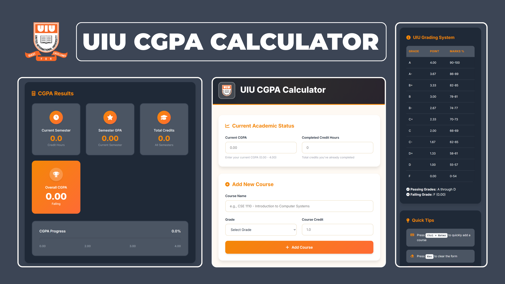

# 🎓 UIU CGPA Calculator

<div align="center">


</div>

<br>

💻 A simple, beautiful and efficient web-based CGPA calculator tailored for **UIU (United International University)** students.

[](https://najibnahindev.github.io/UIU-CGPA_Calculator/) ➡️ **[Try UIU CGPA Calculator](https://najibnahindev.github.io/UIU-CGPA_Calculator/)**  

---

## 🖼️ Preview

<p align="center">
  
</p>

---

## 🧾 About

The **UIU CGPA Calculator** is a lightweight and responsive web app developed with **HTML, CSS, and JavaScript**, allowing UIU students to calculate their academic CGPA with precision and ease. This tool eliminates the need for Excel or manual grade calculations by providing a real-time CGPA computation experience.

---

## ✨ Features

  🎮 **User-friendly UI** with clean layout  
  ➕ **Add unlimited courses** dynamically  
  💯 **Accurate CGPA calculation** as per UIU grading system  
  📱 **Mobile-first responsive design**  
  🔁 **Clear all** option for reset  
  ⚡ Instant result updates without page reload  
  🧠 Smart grade-to-GPA mapping  
  📌 **Formula used:** – CGPA = (Σ (GPA × Credit)) / Σ Credit 
  💻 No backend required – works entirely in the browser  

---

## 🚀 How to Use

1. Enter your **course name** (optional).  
2. Choose the **grade** from the dropdown.  
3. Enter the **credit hour**.  
4. Click **"Add Course"** to include it in the list.  
5. View your **CGPA instantly** on the screen.  
6. Click **"Clear All"** to reset the calculator.  

---

## 🛠️ Tech Stack

| Technology | Purpose |
|------------|---------|
| `HTML5`    | Page structure |
| `CSS3`     | Styling and responsiveness |
| `JavaScript` | Dynamic logic and calculations |
| `GitHub Pages` | Free web hosting for deployment |

---

## 📁 Project Structure

```bash
UIU-CGPA_Calculator/
├── index.html          # Main HTML file
├── style.css           # All visual styles
├── script.js           # JS logic & calculation
├── resources/
│   └── demo.png        # Screenshot preview
|   └── uiuIcon.ico     # Favicon of the website
|   └── UIU_Logo.png        # UIU Logo
└── README.md           # Project documentation

```
---

## 🧠 Learning Outcomes

Through this project, I strengthened my skills in:

- 🎯 DOM Manipulation  
- 🎯 Responsive Design with CSS  
- 🎯 JavaScript-based dynamic form handling  
- 🎯 User-centric UX design  
- 🎯 Deploying with GitHub Pages  
- 🎯 Code modularization  

---

## 🙌 Contributing

Contributions are welcome!  
If you'd like to improve this project, feel free to:

- 🍴 Fork this repository  
- 🛠️ Make your changes  
- 🔁 Submit a pull request  

Let’s build something helpful together!

---

## 📜 License

This project is licensed under the **MIT License**.  
See the [`LICENSE`](./LICENSE) file for details.

---

<div align="center">

⭐ **If you liked this project, don't forget to star the repo!**  
🔗 [**Visit Live Project**](https://najibnahindev.github.io/UIU-CGPA_Calculator/)

</div>

